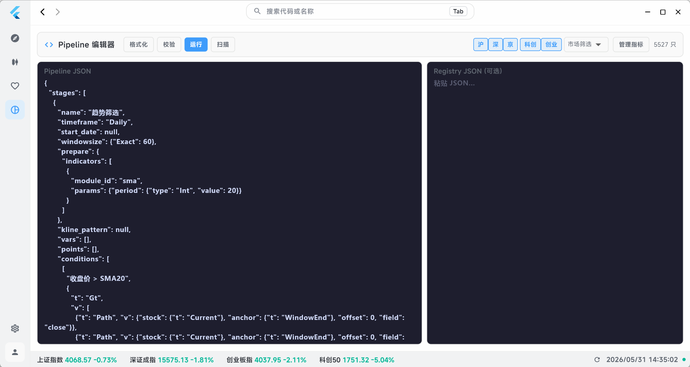
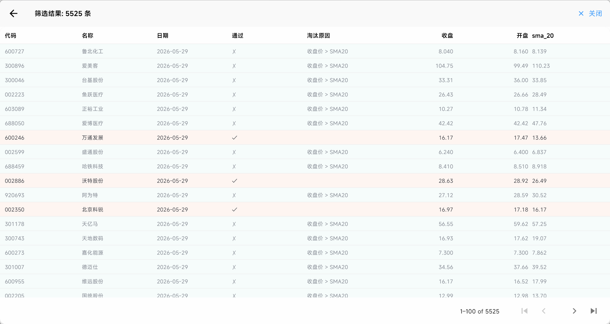
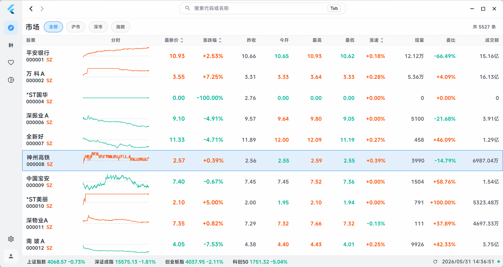
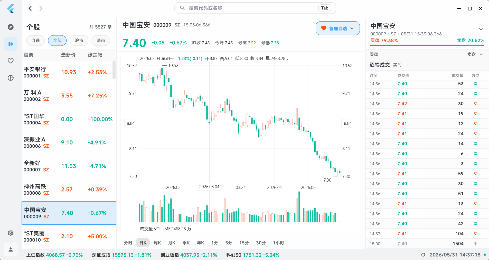
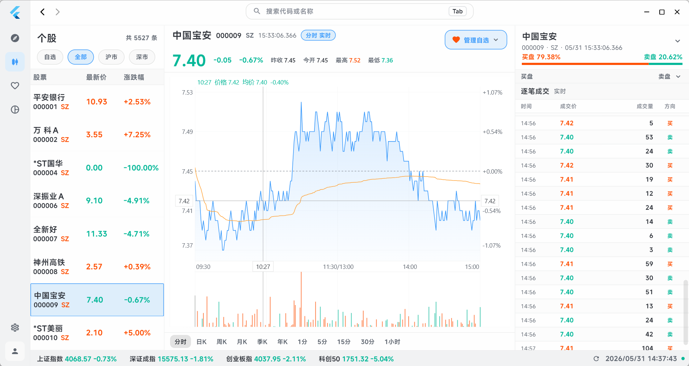
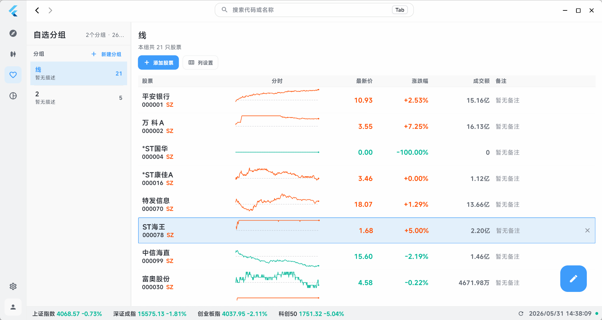

# Stock Screener DSL & Engine

一个用于股票筛选策略的**领域特定语言（DSL）**和**基于 Polars 的执行引擎**，配备 **Flutter 公式树编辑器**进行交互式策略构建。

这是完整私有股票交易终端的精选子集。完整应用包含实时行情、K线图、自选股、回测等功能——由专有数据源驱动。本公开仓库展示筛选器子系统：DSL、引擎、Flutter UI。

## 内容概览

| 组件 | 说明 | 可运行 |
|------|------|--------|
| **`kline-dsl`** (Rust) | 类型化 AST：25+ 表达式类型、K线形态、指标、分时条件 | `cargo build` |
| **`kline-engine`** (Rust) | Polars 批量执行、多线程运行器、形态匹配、编译器/解释器双路径 | `cargo build` |
| **CLI Demo** | 4 个筛选策略对示例数据运行 | `cargo run --example cli_demo` |
| **Flutter UI** (Dart) | 递归公式树编辑器、K线/分时图 Canvas 绘制、结果表格 | 仅源码展示 |

## 快速开始

```bash
git clone https://github.com/TheSeed486/stock-screener-showcase.git
cd stock-screener-showcase
STOCK_DB_DIR=./sample_data cargo run --example cli_demo
cargo test --workspace
```

## 示例：均线策略

用 Rust 代码定义筛选管线：

```rust
let stage = Stage {
    name: "above_sma20".into(),
    indicators: vec![IndicatorCall::new("sma", params! {"period" => 20})],
    conditions: vec![(
        "above_sma20".into(),
        Expr::Gt(Box::new(col("close", 0)), Box::new(col("sma_20", 0))),
    )],
    // ...
};
let pipeline = Pipeline { stages: vec![stage] };
let df = run_pipeline_df(&pipeline, &registry, &provider, &symbols, from, to, None);
```

或者用 JSON 定义（Flutter UI 编译输出）：

```json
{
  "stages": [{
    "name": "above_sma20",
    "prepare": { "indicators": [{ "module_id": "sma", "params": { "period": 20 } }] },
    "conditions": {
      "above_sma20": { "Gt": [{ "Path": { "field": "close" } }, { "Path": { "field": "sma_20" } }] }
    }
  }]
}
```

## 架构

```
┌──────────────────────────────────────┐
│  Flutter UI（公式树编辑器）           │  ── 源码展示
├──────────────────────────────────────┤
│  kline-dsl（AST: Expr, Pipeline）     │  ── 公开 crate
├──────────────────────────────────────┤
│  kline-engine（编译器、运行器）       │  ── 公开 crate
│  ┌────────────────────────────────┐  │
│  │ DataProvider trait（抽象层）   │  │
│  │ ParquetDataProvider（具体实现）│  │
│  └────────────────────────────────┘  │
├──────────────────────────────────────┤
│  私有：TDX 数据源、FRB 宿主          │  ── 不在此仓库
└──────────────────────────────────────┘
```

## 运行截图

<p align="center">
  
  
  
</p>
<p align="center">
  
  
  
</p>

## 工程设计决策

核心设计权衡见 [DESIGN_DECISIONS.md](DESIGN_DECISIONS.md)：
- 为什么选择 Polars 批量执行而非逐股迭代
- 为什么选择类型化 AST 而非字符串 DSL
- 为什么采用编译器 + 解释器双路径
- `DataProvider` trait 如何实现数据源解耦
- 批量优先、逐股回退的执行策略

## 公开仓库不含

私有仓库额外包含：
- **TDX 协议实现** (`tdx_api/`) — 通达信 TCP 二进制协议、GBK 解码、服务器连接池
- **FRB 宿主 crate** (`rust/`) — Flutter-Rust 桥接、数据拉取、缓存、存储
- **完整 Flutter 应用** — 市场概览、个股详情、自选股管理、回测
- **真实行情数据** — 35 年 A 股日线/分钟/Tick 数据

详见 [ARCHITECTURE.md](ARCHITECTURE.md)。

## Flutter UI（源码展示）

`flutter-screener-ui/` 目录包含筛选器及图表的 Flutter 源码：

- **递归公式树编辑器** (`expr_builder.dart`) — 可视化编辑嵌套 `Expr` AST 节点，拖拽绑定参数
- **K线图绘制** (`animated_kline_chart_painters.dart`) — 自定义 Canvas 渲染，支持缩放、拖拽、十字光标
- **分时图绘制** (`minute_time_chart_painters.dart`) — 分钟级时序图，白线/黄线/成交量
- **管线编译器** — 将可视化公式树编译为 JSON 供 Rust 执行

这些文件展示 Flutter 能力，但不可独立构建（依赖 `flutter_rust_bridge` 从私有 Rust 宿主生成的绑定代码）。

## 技术栈

- **Rust**：Polars 0.53、Rayon、serde、chrono、rusqlite
- **Flutter/Dart**：自定义 Canvas 绘制、Riverpod 风格 ViewModel
- **桥接**：`flutter_rust_bridge` v2.11（私有仓库）
- **数据**：Parquet（Polars）、SQLite 元数据目录

## 许可证

MIT — 详见 [LICENSE](LICENSE)
